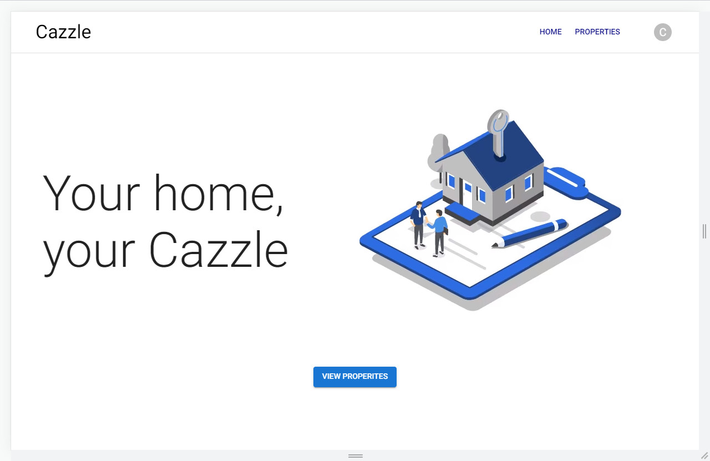
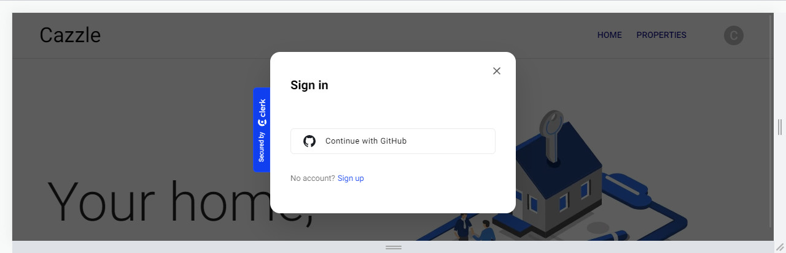
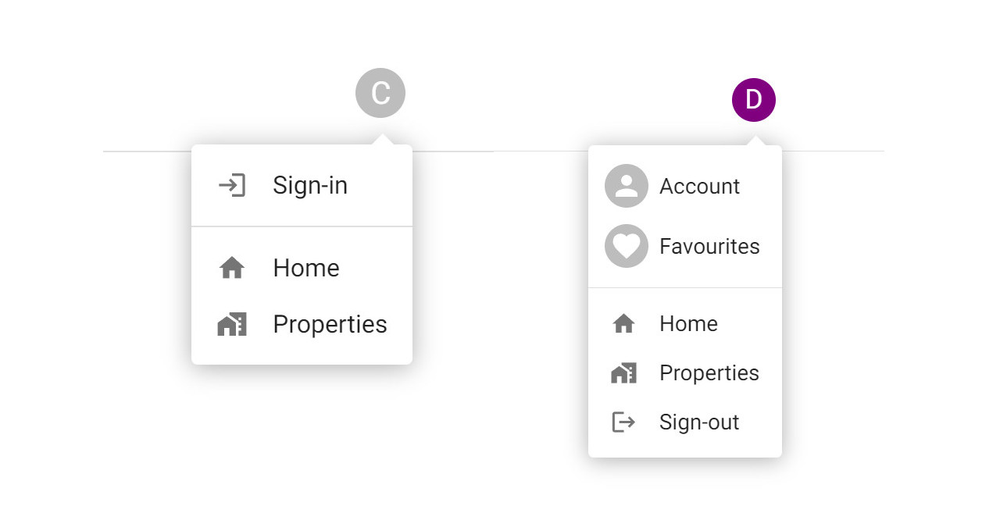

<a href="#"></a> 
# <a href="#"></a> Cazzle | <a href="#" target="_blank"> <strong>Live</strong></a>

> ### Property Portal built with Next.js

<br>
<div align="center">
  <a href="#"></a>
  
  ###
  <a href="#"></a> 
  <a href="#"></a>
  <a href="#"></a>   
  <br>
</div>

<br>

## About
**Cazzle** is real-estate property portal made in <a href="https://github.com/vercel/next.js">**Next.js**</a>

The application utilises <a href="https://github.com/get-convex/convex-js">**Convex**</a> for database and storage, <a href="https://github.com/clerk/javascript">**Clerk**</a> for authentication and <a href="https://github.com/mui/material-ui">**Material UI**</a> for Components and layouts. Combining these tools with Next.js 14 <a href="https://nextjs.org/docs/app/building-your-application">**App router**</a>, <a href="https://github.com/facebook/react">**React**</a> and <a href="https://github.com/Microsoft/TypeScript">**TypeScript**</a> creates a powerful stack to build with. 

<br>

## 📝 Features
<table>
  <thead>
  </thead>
  <tbody>
    <tr>
      <td><strong>🔹 Browse Listings</strong></td>
      <td>Refine results using filters</td>
    </tr>
    <tr><td colspan=2></td></tr>
    <tr>
      <td><strong>🔹 Authentication</strong></td>
      <td>User sign-in/sign-up flows</td>
    </tr>
    <tr><td colspan=2></td></tr>
    <tr>
      <td><strong>🔹 User Favourites</strong></td>
      <td>Add/remove property listings</td>
    </tr>
    <tr><td colspan=2></td></tr>
    <tr>
      <td><strong>🔹 User Page</strong></td>
      <td>View favourited listings</td>
    </tr>
    <tr><td colspan=2></td></tr>
    <tr>
      <td><strong>🔹 Responsive Design</strong></td>
      <td>Adaptive to device viewport</td>
    </tr>
    <tr><td colspan=2></td></tr>      
  </tbody>
</table>

<br>
<p align="right">(<a href="#readme-top">back to top</a>)</p>

## 🔬 Overview

### Planning
Planning involved researching similar property portals such as <a href="https://www.rightmove.co.uk/">Rightmove</a> and <a href="https://keaze.com/">Keaze<a/>. Alongside their websites, both had excellent documentation about thier APIs which were invaluable while developing the application schema. 

<details open>
  <summary><h3>UI Wireframes</h3> </summary>

  User interface (UI) wireframes were created during the pre-development planning phase to visualise how data would need to be displayed
  
  <br>
  <a href="#"></a>
</details>

<br>
<p align="right">(<a href="#readme-top">back to top</a>)</p>

##

### Context Providers
Convex, Clerk and Material UI provision access to their respective APIs via React Context Providers. 

```tsx
const ConvexClerkProvider = (props: { children: React.ReactNode }) => {
  return (
    <ClerkProvider
      publishableKey={process.env.NEXT_PUBLIC_CLERK_PUBLISHABLE_KEY!}
    >
      <ConvexProviderWithClerk client={convex} useAuth={useAuth}>
        {props.children}
      </ConvexProviderWithClerk>
    </ClerkProvider>
  );
};
```

##

### Authentication Flows
Clerk Auth makes implementing authentication straightforward and offers email as well as social authentication. Clerk provides serveral React/Next Components to streamline development. 

<a href="#"></a>

##

### Signed-Out | Signed-In

<a href="#"></a>
<br>
<p align="right">(<a href="#readme-top">back to top</a>)</p>

## Users
Clerk makes available the User object provisioned with **claims** which contains properties such as as user_id and role. 

Within the application, a session token is used to validate user identity when accessing protected areas and performing activities such as viewing favourites.

### Onboarding & Permissions
Users creating an account for the first time have the option to choose either a standard user account or branch account. Depending on which account is chosen, a role is then attributed to the current user which is used throughout the application to authorize and permit actions. 

A **standard user account** grants the user the ability to favourite real-estate properties while browsing the site which can be accessed via the favourites page. A non signed-in user when trying to favourite a listing is prompted to sign-in or create an account.

A **branch account** grants the user the ability to manage a property portfolio via the built-in dashboard.
> Note 📡
> 
> Branch account access is currently work in progress

<br>
<p align="right">(<a href="#readme-top">back to top</a>)</p>

## Responsive web design
> #### Details 📡
Material UI offers a powerful React Component library. As MUI Components create classes at compile time, styling is applied inline via the **sx** prop. Media queries can be set using the MUI provided hook or other means. Although this offers some advantages over CSS such that styling is composed with the Component, as NextJs renders serverside first, browser APIs are unavailable initially meaning elements display incorrectly.

##

### Environment

<a href="#"></a>

### Build Tools

<a href="#"></a>
<a href="#"></a>

### Developer Tools

<a href="#"></a>
<a href="#"></a>

##

### Deployment

<a href="#"></a>

<p align="right">(<a href="#readme-top">back to top</a>)</p>
